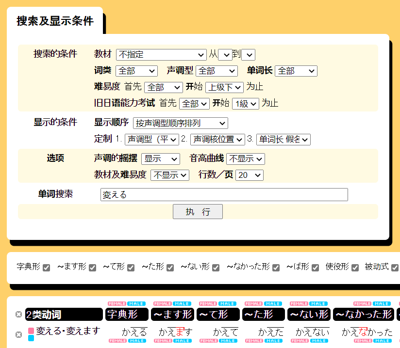

# 发音3：声调

日语的基础声调分为高低两种，一个音拍的声调或者是高，或者是低，不存在汉语那样的上升和下降（不带语气的情况下）。

具体高低程度，如果可以类比汉语普通话声调：
- 高音：差不多是一声（ā）；
- 低音：差不多是轻声（a），不过时长和高音一样，不会变短促。
（一般汉语的轻声只出现在末尾，而日语的低音可以在开头。开头的低音可以可以类比汉语的三声（ǎ），声调尽量平淡，特别是后面上升的部分不要发出。）

<figure>
<svg id="tone-graph" width="650" height="230">
  <text x="10" y="10" fill="var(--green)">汉语 一声</text>
  <polyline points="120 20 300 20" stroke="var(--green)"/>
  <text x="10" y="160" fill="var(--red)">汉语 三声</text>
  <polyline points="120 170 210 220 300 70" stroke="var(--red)"/>
  <text x="10" y="130" fill="var(--blue)">汉语 轻声</text>
  <polyline points="120 150 210 170" stroke="var(--blue)"/>
  <text x="550" y="10" fill="var(--green)">日语 高音</text>
  <polyline points="350 20 530 20" stroke="var(--green)"/> 
  <text x="550" y="140" fill="var(--blue)">日语 低音</text>
  <polyline points="350 150 530 150" stroke="var(--blue)"/> 
</svg>
<figcaption>普通话声调与日语声调</figcaption>
</figure>

> [はる]{1}（春天） 声调类似“[说]{‒}吧”
> [とり]{0}（鸟） 声调类似“[你说]{˅ ‒}”
> [ひとり]{2}（一个人） 声调类似“[你说]{˅ ‒}吧”
> [くるま]{0}（车） 声调类似“[老司机]{˅ ‒ ‒}”

用几个熟悉的词来确认一下高低声调的读法：
> [わたし]{lhh} （我）
> [あなた]{lhl} （你）
> [だれ]{hl} （谁）
> [ありがとう]{lhlll} （谢谢）（[ありがとう]{lhhll}也可）

.

### 单词的声调标注

日语单词的声调有一定限制，并不会出现任意的高低排列。有如下规则：
1. 最多只有一次从高降到低，并且之后一直是低；
2. 如果在下降之前有2个以上音拍（或者没有下降），开头2个音拍一定是“低高”。

根据以上规则，看看哪些是合法的单词声调：
> [あああ]{lhh} :v:（没有下降）
> [あああ]{hhh} :x:（没有下降，但不是“低高”开头）
> [あああ]{lhl} :v:（有一次下降）
> [あああ]{hhl} :x:（有一次下降，但不是“低高”开头）
> [あああ]{hll} :v:（有一次下降，下降之前只有1个音拍，无需“低高”开头）
> [あああああ]{lhhll} :v: （有一次下降）
> [あああああ]{lhhlh} :x: （有一次下降，但之后又上升）

这样看来，对于一个固定长度的单词，声调可以调整的部分只有两点：
1. 是否有下降；
2. 下降的位置。

这样就可以只用一个数字来标注声调：
- 如果有下降，用((1)),((2)),((3))...表示最后一个高音的位置；
- 如果没有下降，用((0))表示。

|声调|数字|声调|数字|
|-|:-:|-|:-:|
|[あああ]{1}|((1))|[あああああ]{1}|((1))
|[あああ]{2}|((2))|[あああああ]{2}|((2))
|[あああ]{3}|((3))|[あああああ]{3}|((3))
|[あああ]{0}|((0))|[あああああ]{4}|((4))
|           |     |[あああああ]{5}|((5))
|           |     |[あああああ]{0}|((0))

大部分日语词典的声调标注就是这种数字标注法。虽然不如直接划线直观，但方便输入和排版。

试试能不能读懂数字标注：
> （开始）はじまり((0)) =  *[はじまり]{0}*{.ans}
> （暑假）なつやすみ((4)) = *[なつやすみ]{4}*{.ans}
> （妹妹）いもうと((4)) = *[いもうと]{4}*{.ans}
> （返回）かえる((1)) = *[かえる]{1}*{.ans}
>
> <button onclick="toggleAnswer" data-alt-text="隐藏答案">查看答案</button>
{.exercise}

要注意，当单词有拗音和促音的时候，数字标注比较容易弄错。最根本原则是：如果占据发音时间，就算一个音拍。
> [ちゅうごくじん]{4}((4))　[ち]{0}[ゅうごくじん]{hhhlll}:x:
> 因为ちゅ发音长度和ち相同，ちゅ只算一个音拍。
>
> [しゃいん]{1}((1))　[し]{1}[ゃいん]{lll}:x:
> 因为しゃ是一个音拍，音拍只能整体是高或者低。
>
> [ほっかいどう]{3}((3))　[ほっかいどう]{4}:x:
> 因为っ有停顿，单独算一个音拍。
>
> [ちょっぴり]{3}((3))　[ち]{0}[ょっぴり]{hhll}:x:　[ちょっぴり]{4}:x:
> 拗音和促音连在一起，容易混淆视线。
>
> [デパート]{2}((2))　[デパート]{3}:x:
> 虽然片假名用长音符号，因为“ー”占据发音时间，单独算一个音拍。

.

一些较新的词典和教科书会用一种简化的划线法来标注声调：

> は*じまり*{.plain} =  [はじまり]{0}
> な*つやす*み = [なつやすみ]{4}
> い*もうと* = [いもうと]{4}
> *か*える = [かえる]{1}
{.tone-simple}

这种标注方式相当简单易懂：低音不划线，高音上划线，并且高音结束有一弯折。

.

### 单词结尾的下降？

上面的数字标注法中，有一个奇怪的问题：
> あああ((3)) = [あああ]{3}
> あああ((0)) = [あああ]{0}
> 这两者有什么区别？难道可以随便标注吗？

简化划线法也有这个问题：
> あ*ああ* vs あ*ああ*{.plain}
> {.tone-simple}

就单词本身的声调来说，这两种确实没有区别。区别在于后续的助词的声调：大多数助词并没有固定的声调，而是跟前面的词合在一起，当成一个更长的词读出。而整体的声调的数字和单词本身是一样的。

> 以主语助词が为例：
> [わたし]{0}((0))　[わたしが]{0}((0))
> [あなた]{2}((2))　[あなたが]{2}((2))
> [いもうと]{4}((4))　[いもうとが]{4}((4))

很明显，声调为((0))的单词，后续的助词声调保持高音；而结尾下降的单词（声调数字＝单词长度），后续的助词下降为低音。

.

### 动词的变形的声调?

不知道你有没有发现，新标日的词汇表里的动词的声调都是同样的模式：
>>>
第5课词汇表 77页：
'''
|-|-|
や*すみま*す　|（休みます）
は*たらきま*す　|（働きます）
は*じまりま*す　|（始まります）
お*わりま*す　|（終わります）
お*きま*す |（起きます）
ね*ま*す |（寝ます）
べ*んきょうしま*す |（勉強します）
{.hidden-table .tone-simple}
'''
<<<

总结一下，就是结尾的ます的ま后下降。（当然有例外，比如“'許可します'”的声调是 *きょ*かします。）
{.tone-simple}

当然事情没有那么简单。我们来把上面的动词变成词典形和て形：
>>>
'''
|-|-|-|-|-|
や*す*む　          |（休む）  |      |や*す*んで          |（休んで）
は*たらく*{.plain}　|（働く）  |      |は*たらいて*{.plain}|（働いて）
は*じまる*{.plain}　|（始まる）|      |は*じまって*{.plain}|（始まって）
お*わる*{.plain}　  |（終わる）|      |お*わって*{.plain}  |（終わって）
お*き*る            |（起きる）|      |*お*きて            |（起きて）
ね*る*{.plain}      |（寝る）  |      |ね*て*{.plain}      |（寝て）
べ*んきょうする*{.plain} |（勉強する）| |べ*んきょうして*{.plain}|（勉強して）
| | |30px| | |
{.hidden-table .tone-simple .col-width}
'''
<<<

不仅词典形的声调出现了不一致，有的动词变为て形后，声调下降的位置还改变了。

甚至还有读音相同，只能靠声调区分的动词：
> *か*える'（帰る）'　返回
> か*える*{.plain}'（変える）'　改变
> 
> 你担心它们变成ます形无法区分？
> 不用担心，因为它们动词类型不同，变成ます形后读音有区别：
>
> か*えりま*す'（帰ります）'
> か*えま*す'（変えます）'
{.tone-simple}

非常可惜，由于新标日初级教材的词汇表中，动词以ます形列出，导致声调雷同；\
而最重要的词典形声调，以及其他形式的声调都无处可查，只能通过听录音来慢慢积累。\
这无疑是很低效的。

如果想要掌握正确的动词以及变形的声调，网上有不少资源，我推荐一个：

[OJAD - オンライン日本語アクセント辞書](http://www.gavo.t.u-tokyo.ac.jp/ojad/){target="_blank"}

<figure>

<figcaption>在这里输入并搜索</figcaption>
</figure>

<figure>

<figcaption>动词的不同形式的声调</figcaption>
</figure>

这个网站除了动词以外，也有形容词和名词的声调，并且动词和形容词有真人录音，点击单词下方的红色和蓝色的小按钮可以发音。

.

### 怎么记声调？

- 培养语感：多查多读，不确定时要去查，不要留下错误印象。
- 技巧：
  - 特别留意高音在第一个音拍（数字为((1))）的单词，如[いま]{1}（'今'），因为这种声调听起来最特殊。
  - 特别留意只有声调不同的几组单词，比如[いま]{1}（'今'）和[いま]{2}（'居間'），[かえる]{1}（'帰る'）和[かえる]{0}（'変える'）。
- 顺其自然（躺平）：
  - 不像汉语，日语并不是非常依赖声调的语言，大部分词汇并不需要声调来区分意思。
  - 很多日本人的声调也并不准确，只有播音员、声优等职业才会对正确声调有较高的要求。
  - 教科书和词典的声调主要是以东京口音为标准，在日本其他地方，即使不说方言，声调也会不一样。